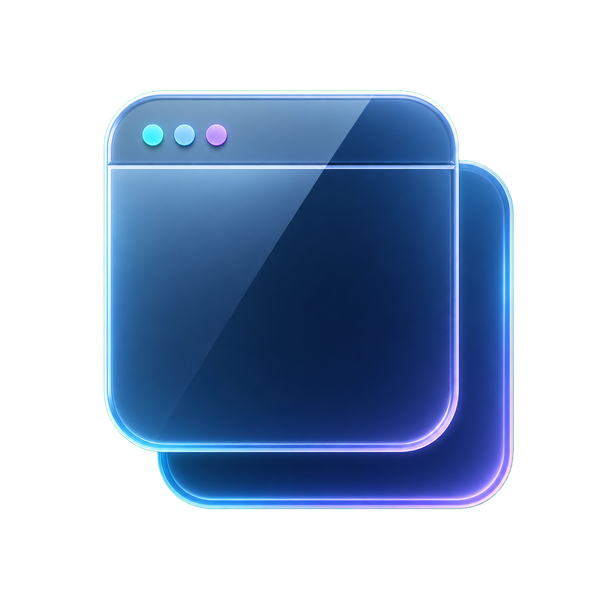

# Overlay Browser

<p align="center">
  
</p>

<p align="center">
  透明度を調整し、ほかのウィンドウの上に表示できるWindows用デスクトップブラウザ<br>
  A Windows desktop browser with adjustable opacity and always-on-top display
</p>

[日本語](#日本語) / [English](#english)

---

## 日本語

### 概要

Overlay Browserは、Webページやローカルファイルを、
ほかのアプリのそばに表示しておくためのWindows用ブラウザです。

ウィンドウの透明度、最前面表示、複数タブ、固定ブックマークバー、タスクトレイ常駐など、
必要なページを邪魔になりにくい形で開いておくための機能を備えています。
画面全体は青黒を基調とした半透明のダークテーマで統一しています。

### 主な特徴

#### オーバーレイ表示

- ウィンドウの透明度を35%から100%まで調整
- ［設定］から常に最前面に表示するかを切り替え
- ウィンドウの移動、最大化、最小化、サイズ変更に対応
- タイトルバー、タブ、メニュー、ダイアログを統一したダークテーマ
- 閉じるボタンで画面を隠し、タスクトレイへ常駐
- Windowsへのサインイン時に、画面を開かずタスクトレイで起動可能

#### ブラウザ機能

- ChromiumベースのWeb表示
- 複数タブの追加、切り替え、個別終了
- 戻る、進む、ホーム、再読み込み、外部ブラウザで開く
- `https://`を省略したURL入力
- 起動時とホームボタンで開くホームURLを設定
- 最後に開いたURLを保存
- HTML、テキスト、Markdown、JSON、XML、PDF、
  画像ファイルをWindowsの［プログラムから開く］から表示

［プログラムから開く］へ登録する拡張子は、
- `.htm`、`.html`、`.txt`、`.md`、`.json`、`.xml`、`.pdf`、`.png`、`.jpg`、`.jpeg`、`.gif`、`.webp`です。
インストール時に既定のアプリは変更しません。

#### ブックマーク

- 表示中のページをブックマークへ追加
- フォルダ階層を保ったブックマーク一覧
- ブックマークの追加、名前変更、移動、削除
- ［設定］→［ブックマークバーを固定表示］で、ブックマークを画面上部へ常時表示
- ChromeまたはEdgeの既定プロファイルからインポート
- Chrome / Edge互換のブックマークHTMLをインポート、エクスポート
- 重複URLを避けながら既存ブックマークへ統合

#### ページ翻訳

- 右クリックの［ページを翻訳］でGoogle翻訳のページ表示へ切り替え
- ［Geminiでページを翻訳］で、元のレイアウトを保ったまま表示文章を置き換え
- Windowsの表示言語を翻訳先として自動選択
- 翻訳の文体や固有名詞の扱いをカスタマイズ
- Gemini APIの混雑時に、再試行または代替モデルへの切り替えを選択
- 翻訳結果はページを再読み込みすると元の表示へ復元
- 翻訳手順と注意事項を日本語・英語のヘルプで表示

通常の閲覧とGoogle翻訳にはGemini APIキーは不要です。
Gemini翻訳を利用する場合だけ、利用者自身のGemini APIキーが必要です。

### インストール

#### 必要な環境

- Windows 10 / 11
- 64bit Windows

配布用インストーラーは.NETランタイムとChromium関連ファイルを含む自己完結型です。
通常のインストールでは、.NET SDKを別途導入する必要はありません。

#### 手順

1. このリポジトリのReleasesから`setup.exe`と`Setup.msi`を同じフォルダへダウンロードします。
   ZIPで配布されている場合は、先にすべて展開します。
2. 起動中のOverlay Browserを終了します。
3. `setup.exe`を実行します。`Setup.msi`を直接実行することもできます。
4. インストール後、デスクトップまたはスタートメニューのショートカットから起動します。

以前のバージョンがインストールされている場合は、新しいインストーラーから更新できます。
アンインストールはWindowsの［インストールされているアプリ］または［プログラムと機能］から行えます。

### 証明書なしインストーラーの警告

現在配布している`setup.exe`、`Setup.msi`およびアプリ本体には、
発行元をWindowsへ証明するコード署名証明書を付けていません。

そのため、ダウンロード後の初回実行時にMicrosoft Defender SmartScreenが、
次のような警告を表示する場合があります。

- 「WindowsによってPCが保護されました」
- 「認識されないアプリの起動を停止しました」
- 「発行元を確認できません」

これは、署名や配布実績に基づく信頼情報が不足している時に表示される警告です。
警告が表示されたことだけで、マルウェアと判定されたという意味ではありません。一方で、
署名がないことはファイルの安全性を保証するものでもありません。

次の条件をすべて確認できる場合に限り、［詳細情報］→［実行］を選択してください。

- このリポジトリのReleases、または信頼できる管理者から入手した
- ファイル名だけでなく、配布元とリリース内容を確認した
- SHA-256が公開されている場合は、ダウンロードしたファイルのハッシュと一致している

不明なWebサイト、チャット、メールなどから入手した同名ファイルでは実行しないでください。
組織のポリシーやWindowsのSmart App Controlによって実行が禁止されている場合は、
保護機能を無効にせず管理者へ確認してください。

MicrosoftによるSmartScreenの説明は、
[SmartScreen reputation for Windows app developers]
(https://learn.microsoft.com/en-us/windows/apps/package-and-deploy/smartscreen-reputation)
を参照してください。

### 翻訳機能とデータの扱い

- アプリ設定とブックマークは`%LOCALAPPDATA%\OverlayBrowser\settings.json`へ保存します。
- Gemini APIキーはJSONファイルではなく、Windows資格情報マネージャーへ保存します。
- ［Geminiでページを翻訳］を実行した時だけ、翻訳のカスタマイズ内容とページ内の表示文章をGemini APIへ送信します。
- Gemini翻訳では、画像、CSS、スクリプトを送信しません。
- ［ページを翻訳］では、表示中ページのURLをGoogle翻訳のページ表示に使用します。
- 翻訳のカスタマイズ欄へAPIキー、パスワード、個人情報などを入力しないでください。

ログインが必要なページやアクセス制限のあるページは、翻訳サービス側の制約により表示または翻訳できない場合があります。

### ソースからのビルド

#### 必要なもの

- .NET 10 SDK
- 64bit Windows
- Visual Studioからインストーラーを作成する場合は、Visual Studio Installer Projects拡張機能

#### アプリをビルド

```powershell
dotnet restore OverlayBrowser/OverlayBrowser.csproj
dotnet build OverlayBrowser/OverlayBrowser.csproj -c Release
```

#### 自己完結型の配布フォルダを作成

```powershell
dotnet publish OverlayBrowser/OverlayBrowser.csproj -c Release -r win-x64 --self-contained true
```

出力先は次のフォルダです。

```text
OverlayBrowser/bin/Release/net10.0-windows/win-x64/publish/
```

CefSharpとChromiumは複数のDLL、実行ファイル、言語ファイルを必要とします。
`OverlayBrowser.exe`だけを別の場所へコピーせず、`publish`フォルダ全体を扱ってください。

#### MSIインストーラーを作成

1. Visual Studio Installer Projects拡張機能を導入します。
2. Visual Studioで`OverlayBrowser.sln`を開きます。
3. 構成を`Release`にします。
4. `Installer`プロジェクトをリビルドします。

生成先:

- `Installer/Release/setup.exe`
- `Installer/Release/Setup.msi`

`Setup/OverlayBrowser.iss`は、Inno Setup 6を使用する場合の代替定義です。

### サードパーティ製ソフトウェア / NuGet

このプロジェクトが現在使用しているNuGetパッケージは次のとおりです。
`CefSharp.Wpf.NETCore`が直接参照で、残りはそこから復元される間接依存関係です。

| パッケージ | バージョン | 用途 | ライセンス |
| --- | ---: | --- | --- |
| [CefSharp.Wpf.NETCore](https://www.nuget.org/packages/CefSharp.Wpf.NETCore/150.0.110) | 150.0.110 | WPF用Chromiumブラウザコントロール | [BSDライセンス](https://github.com/cefsharp/CefSharp/blob/master/LICENSE) |
| [CefSharp.Common.NETCore](https://www.nuget.org/packages/CefSharp.Common.NETCore/150.0.110) | 150.0.110 | CefSharp共通ランタイム | [BSDライセンス](https://github.com/cefsharp/CefSharp/blob/master/LICENSE) |
| [chromiumembeddedframework.runtime](https://www.nuget.org/packages/chromiumembeddedframework.runtime/150.0.11) | 150.0.11 | Chromium Embedded Framework共通ランタイム | [CEFライセンス](https://github.com/chromiumembedded/cef/blob/master/LICENSE.txt) |
| [chromiumembeddedframework.runtime.win-x64](https://www.nuget.org/packages/chromiumembeddedframework.runtime.win-x64/150.0.11) | 150.0.11 | Windows x64向けCEFネイティブファイル | [CEFライセンス](https://github.com/chromiumembedded/cef/blob/master/LICENSE.txt) |

CefSharpはChromium Embedded Framework（CEF）を使用し、CEFはChromiumおよび複数のオープンソースコンポーネントを含みます。
それぞれの著作権とライセンスは各権利者に帰属します。詳しくは
[CefSharp](https://github.com/cefsharp/CefSharp)、
[CEF](https://github.com/chromiumembedded/cef)、
[Chromiumのライセンス](https://chromium.googlesource.com/chromium/src/+/main/LICENSE)を参照してください。

---

## English

### Overview

Overlay Browser is a Windows desktop browser designed to keep webpages and local files visible beside other applications.

It provides adjustable opacity, always-on-top display, multiple tabs, a pinned bookmark bar, 
and notification-area operation. The interface uses a consistent translucent dark theme based on deep blue, cyan, and violet.

### Main features

#### Overlay display

- Adjust window opacity from 35% to 100%
- Toggle always-on-top display from Settings
- Move, maximize, minimize, and resize the window
- Consistent dark theme for the title bar, tabs, menus, and dialogs
- Hide the window in the notification area with the Close button
- Start in the notification area without opening the main window at Windows sign-in

#### Browser

- Chromium-based web rendering
- Add, switch, and close multiple tabs
- Back, Forward, Home, Reload, and Open in external browser commands
- Enter URLs without the `https://` prefix
- Set a home URL for startup and the Home button
- Restore the last opened URL
- Open HTML, text, Markdown, JSON, XML, PDF, and image files through Windows **Open with**

The installer registers Overlay Browser as an **Open with** option for 
- `.htm`, `.html`, `.txt`, `.md`, `.json`, `.xml`, `.pdf`, `.png`, `.jpg`, `.jpeg`, `.gif`, and `.webp`. 
It does not change the default application for these file types.

#### Bookmarks

- Add the current page to bookmarks
- Keep bookmarks in a folder hierarchy
- Add, rename, move, and delete bookmarks
- Pin bookmarks below the menu bar with **Settings → Pin bookmark bar**
- Import the default Chrome or Edge profile
- Import and export Chrome / Edge-compatible bookmark HTML
- Merge imported bookmarks while avoiding duplicate URLs

#### Page translation

- Open the current page through Google Translate from the right-click **Translate page** command
- Replace visible text while preserving the original layout with **Translate page with Gemini**
- Automatically use the Windows display language as the target language
- Customize translation style and treatment of proper names
- Retry or select an alternative model when the Gemini API is busy
- Reload the page to restore the original text
- Read translation setup and safety information in Japanese and English help

Normal browsing and Google Translate do not require a Gemini API key. A user-provided Gemini API key is required only for Gemini translation.

### Installation

#### Requirements

- Windows 10 / 11
- 64-bit Windows

The distributed installer contains a self-contained build with the .NET runtime and Chromium files. 
The .NET SDK is not required for normal installation.

#### Steps

1. Download both `setup.exe` and `Setup.msi` from this repository's Releases page into the same folder. 
   If they are provided in a ZIP archive, extract all files first.
2. Exit any running instance of Overlay Browser.
3. Run `setup.exe`. You can also run `Setup.msi` directly.
4. Start Overlay Browser from the desktop or Start menu shortcut.

If an earlier version is already installed, the new installer can update it. 
Use Windows **Installed apps** or **Programs and Features** to uninstall the application.

### Unsigned installer warning

The currently distributed `setup.exe`, `Setup.msi`, 
and application binaries are **not code-signed** with a certificate that proves the publisher's identity to Windows.

Microsoft Defender SmartScreen may therefore show a warning during the first run after download, including:

- *Windows protected your PC*
- *Microsoft Defender SmartScreen prevented an unrecognized app from starting*
- *Publisher could not be verified*

This is a reputation warning shown when Windows does not have enough trust information based on a signature and distribution history. 
The warning alone does not mean that the file has been identified as malware. 
However, the absence of a signature is not proof that a file is safe.

Select **More info → Run anyway** only after confirming all of the following:

- The file came from this repository's Releases page or a trusted administrator.
- You verified the download source and release details, not only the file name.
- If a SHA-256 value is published, it matches the downloaded file.

Do not run a file with the same name obtained from an unknown website, 
chat, or email. If an organizational policy or Windows Smart App Control blocks the file, 
do not disable the protection; contact the administrator instead.

See Microsoft's [SmartScreen reputation for Windows app developers]
(https://learn.microsoft.com/en-us/windows/apps/package-and-deploy/smartscreen-reputation) for details.

### Translation and data handling

- Application settings and bookmarks are stored in `%LOCALAPPDATA%\OverlayBrowser\settings.json`.
- The Gemini API key is stored in Windows Credential Manager, not in the JSON settings file.
- The saved translation preference and visible webpage text are sent to the Gemini API only when **Translate page with Gemini** is selected.
- Gemini translation does not send images, CSS, or scripts.
- **Translate page** uses the current page URL to open the Google Translate page view.
- Do not enter API keys, passwords, personal data, or other secrets in the translation preference field.

Pages that require sign-in or enforce access restrictions may not be available through an external translation service.

### Build from source

#### Requirements

- .NET 10 SDK
- 64-bit Windows
- Visual Studio Installer Projects extension when building the MSI installer

#### Build the application

```powershell
dotnet restore OverlayBrowser/OverlayBrowser.csproj
dotnet build OverlayBrowser/OverlayBrowser.csproj -c Release
```

#### Create a self-contained distribution folder

```powershell
dotnet publish OverlayBrowser/OverlayBrowser.csproj -c Release -r win-x64 --self-contained true
```

Output:

```text
OverlayBrowser/bin/Release/net10.0-windows/win-x64/publish/
```

CefSharp and Chromium require multiple DLLs, executables, locale files, and resources. 
Do not copy `OverlayBrowser.exe` by itself; keep the complete `publish` folder together.

#### Build the MSI installer

1. Install the Visual Studio Installer Projects extension.
2. Open `OverlayBrowser.sln` in Visual Studio.
3. Select the `Release` configuration.
4. Rebuild the `Installer` project.

Output:

- `Installer/Release/setup.exe`
- `Installer/Release/Setup.msi`

`Setup/OverlayBrowser.iss` is retained as an alternative definition for Inno Setup 6.

### Third-party software / NuGet

The project currently restores the following NuGet packages. `CefSharp.Wpf.NETCore` is the direct package reference; the other packages are transitive dependencies.

| Package | Version | Purpose | License |
| --- | ---: | --- | --- |
| [CefSharp.Wpf.NETCore](https://www.nuget.org/packages/CefSharp.Wpf.NETCore/150.0.110) | 150.0.110 | Chromium browser control for WPF | [BSD license](https://github.com/cefsharp/CefSharp/blob/master/LICENSE) |
| [CefSharp.Common.NETCore](https://www.nuget.org/packages/CefSharp.Common.NETCore/150.0.110) | 150.0.110 | Shared CefSharp runtime | [BSD license](https://github.com/cefsharp/CefSharp/blob/master/LICENSE) |
| [chromiumembeddedframework.runtime](https://www.nuget.org/packages/chromiumembeddedframework.runtime/150.0.11) | 150.0.11 | Shared Chromium Embedded Framework runtime | [CEF license](https://github.com/chromiumembedded/cef/blob/master/LICENSE.txt) |
| [chromiumembeddedframework.runtime.win-x64](https://www.nuget.org/packages/chromiumembeddedframework.runtime.win-x64/150.0.11) | 150.0.11 | Native CEF files for Windows x64 | [CEF license](https://github.com/chromiumembedded/cef/blob/master/LICENSE.txt) |

CefSharp uses the Chromium Embedded Framework (CEF), and CEF includes Chromium and other open-source components. Their copyrights and licenses remain with their respective owners. See [CefSharp](https://github.com/cefsharp/CefSharp), 
[CEF](https://github.com/chromiumembedded/cef), and the 
[Chromium license](https://chromium.googlesource.com/chromium/src/+/main/LICENSE) for details.
